# 2D Ising Model for Ferromagnetism

## 1. Objectives

We simulate the 2D Ising model for ferromagnetism on a square lattice with nearest-neighbor interactions.  
This Monte Carlo simulation is based on the Metropolis algorithm.  
We carry out the simulation across multiple temperatures and verify our results by comparing them to theoretical predictions.

---

## 2. Introduction

Below a certain temperature known as the Curie temperature $$T_c$$, a material exhibits spontaneous magnetization $$M$$.  
Above this temperature, the material is no longer magnetized.

Magnetization is induced by the state of the spins in the material:

- **Ferromagnetism**: At low temperature ($$T < T_c$$), spin interactions lead to alignment and the formation of magnetic domains.  
  $$\langle M \rangle \approx 1$$.

- **Paramagnetism**: At high temperature ($$T > T_c$$), thermal agitation dominates and spins orient randomly.  
  $$\langle M \rangle \approx 0$$.

- **Diamagnetism**: Also at low temperature, with random distribution of up and down spins:  
  $$0 < \langle M \rangle < 1$$.

---

## 3. Ising Model

We consider a square 2D lattice $$N \times N$$.  
Each node has a spin $$S = \pm 1$$ and interacts with its 4 nearest neighbors via a coupling constant $$J > 0$$.

The analytical solution given by Onsager in 1944 for the average magnetization $$\langle M \rangle$$ is:

$$
\langle M \rangle = 
\begin{cases}
\left(1 - \frac{1}{\sinh^4(2/T)}\right)^{1/8} & \text{if } T < T_c \\\\
0 & \text{otherwise}
\end{cases}
$$

The Curie temperature is given by:

$$
\sinh\left(\frac{2}{T_c}\right) = 1 \Rightarrow T_c = 2.2692
$$

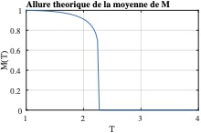

---

## 4. Monte Carlo Simulation — Metropolis Algorithm

The Monte Carlo simulation follows the Metropolis algorithm.  
We define the energy variation for a spin flip:

$$
\Delta E = 2 J S_{ij} (S_G + S_D + S_H + S_B)
$$

Where \( S_G, S_D, S_H, S_B \) are the left, right, top, and bottom neighbor spins.

The transition probability is:

$$
P =
\begin{cases}
1 & \text{if } \Delta E < 0 \\\\
e^{-\frac{\Delta E}{k_B T}} & \text{otherwise}
\end{cases}
$$

---

## 5. Simulation Workflow

1. Define problem size $$N$$  
2. Set coupling constant $$J$$  
3. Initialize temperature $$k_BT$$  
4. Set number of iterations $$T$$  
5. Initialize the spin matrix  
6. Randomly select a spin at each iteration  
7. Compute energy difference $$\Delta E$$  
8. Apply Metropolis criterion  
9. Compute magnetization over time

---

## 6. Example: Magnetization for 100,000 Iterations

Initial state: all spins up.

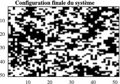

Over time, the system evolves through ferromagnetic → diamagnetic → paramagnetic states.

3D view of the spin matrix:

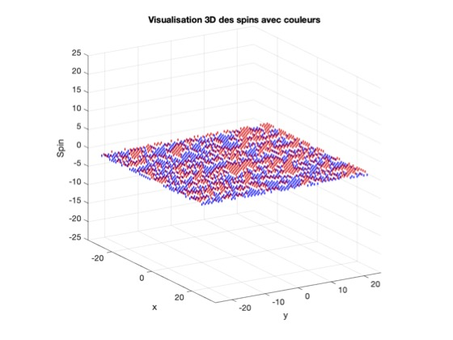  
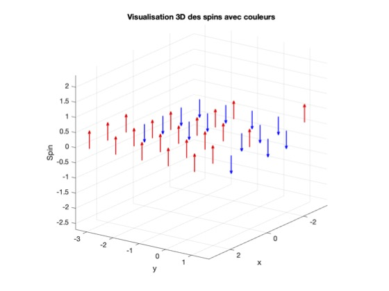

Magnetization vs iteration count:

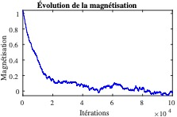

Mean magnetization over second half: **0.006** → paramagnetic state.

---

## 7. Temperature Sweep: 1,000,000 Iterations

By running the simulation across various $$k_BT$$ values, we recover $$T_c$$ and validate the model.

Magnetic susceptibility:

$$
\chi_m = \frac{\langle M^2 \rangle - \langle M \rangle^2}{k_B T}
$$

Comparison of material types:

| Property | Diamagnetic | Paramagnetic | Ferromagnetic |
|----------|-------------|--------------|---------------|
| $$\chi_m$$ | $$\ll 1$$ | $$>1$$ | $$\approx 0$$ |
| Field response | Repels field | Weak attraction | Strong attraction |
| Spontaneous $$M$$ | None | None | Yes |
| Spin behavior | Random | Semi-aligned | Aligned |

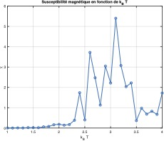  
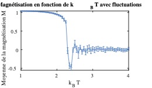

Below $$T_c$$ (e.g. $$k_BT = 1.5$$):

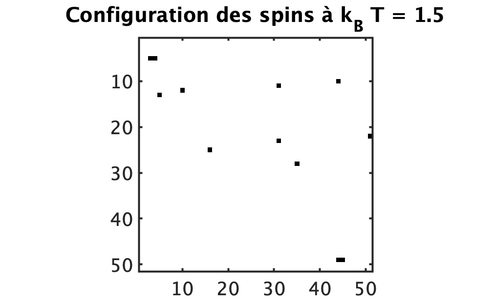

At $$T_c$$:

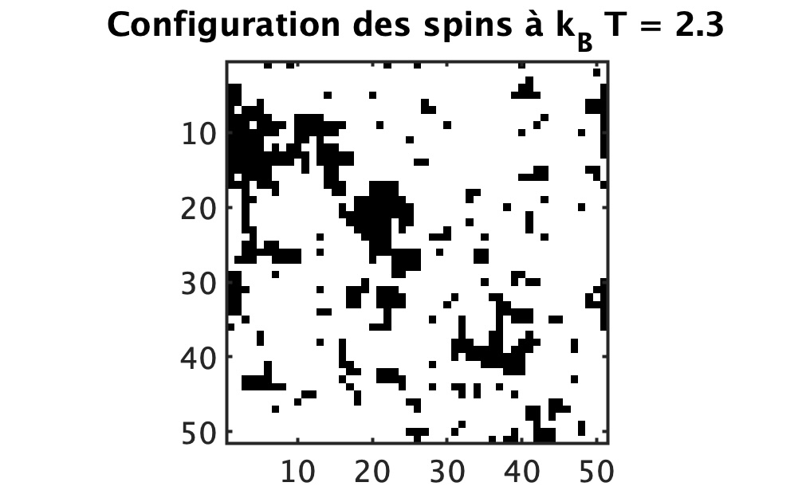

Above $$T_c$$:

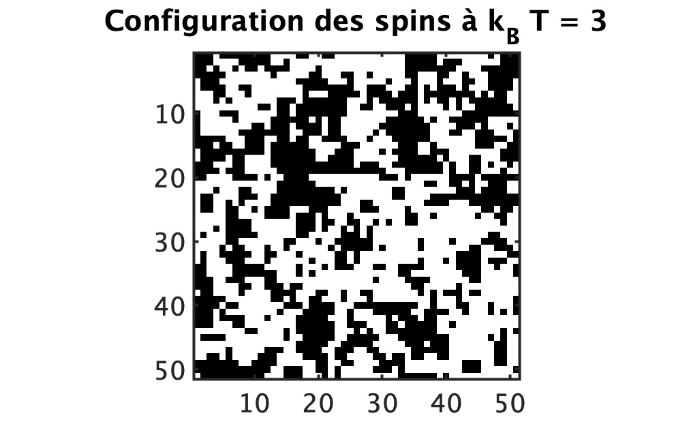

---

## 8. Special Case: Low T and Random Initial State

At low temperatures, thermal fluctuations are minimal and the system tends to minimize its total energy.

Starting from a random spin configuration:

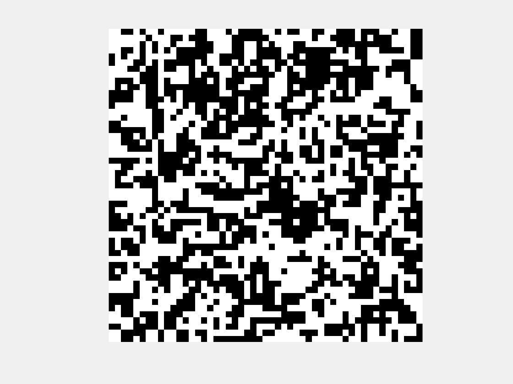

These snapshots illustrate how **spins gradually self-organize into aligned regions (clusters)**.  
This is known as **phase separation**, and reflects the system’s attempt to minimize the energy associated with domain boundaries.

As the simulation progresses, **aligned domains grow**, and **domain walls shrink**, resulting in **spontaneous long-range order**.

This effect is governed by the Ising Hamiltonian:

$$
\mathcal{H} = -J \sum_{\langle i,j \rangle} S_i S_j
$$

Where:
- \( S_i = \pm 1 \) is the spin at site \( i \),
- \( J > 0 \) favors alignment (ferromagnetic coupling),
- The sum runs over all nearest-neighbor pairs \( \langle i,j \rangle \).

This mechanism is a simple yet powerful example of how **complex global structure can emerge from local rules** — a principle widely applicable in machine learning, collective behavior modeling, and distributed optimization.

---

## 9. Conclusion

We implemented a Monte Carlo simulation of the 2D Ising model and visualized how microscopic spin interactions induce macroscopic magnetization.  
Our results are consistent with theoretical predictions and clearly demonstrate the Curie transition.

---

## 10. Utilisation

- **Simulated Annealing**: The Ising model formalism maps directly to combinatorial optimization tasks such as scheduling, routing, and resource allocation.
- **Hopfield Networks**: It forms the backbone of energy-based neural networks for memory and pattern recognition.
- **Quantum Annealing**: The Ising Hamiltonian is the core model used by D-Wave and other quantum optimization platforms.
- **Emergent Computation**: Phase transitions and cluster dynamics mirror how complex global behavior can emerge from local interactions — a valuable paradigm for AI, neuromorphic systems, and adaptive algorithms.
